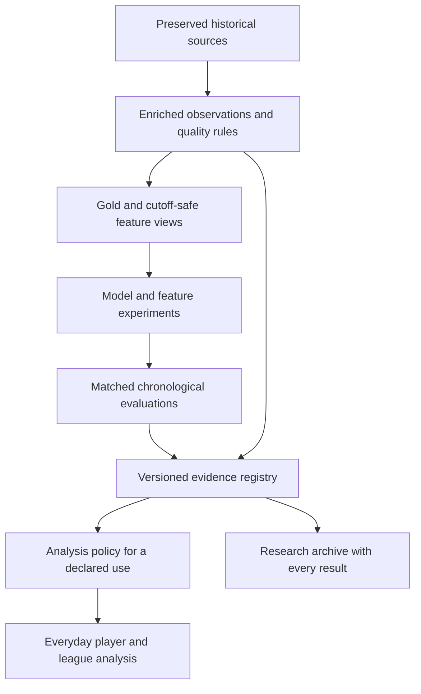

# NextGen as an evidence-controlled analysis system

> Design record from September 23, 2026, with dated follow-ups. Use the
> [architecture overview](README.md) for current system boundaries and
> [operations](../operations/README.md) for maintained commands.

Implemented September 23, 2026. The serving policy, immutable analysis release,
corrected data pipeline, multi-outcome evaluations and dashboard are now connected.
See [implementation and operating instructions](../history/nextgen_system_implementation_2026-09-23.md)
for exact releases, verification and the remaining research limitations. This
system does not grant approval to a model merely because it has been implemented.

Current-season point rankings are now published in the dashboard, with remaining-
season and next-four-week horizons, roster/free-agent integration, and explicit
forecast evidence labels. The final advanced challengers did not qualify against
the stronger reference policy, so the current ranking release serves references.
See the [ranking results and operating guide](../history/nextgen_rankings_2026-09-23.md).

September 24 follow-up: the [passing-yard audit and field review](../research/qb_passing_forecasts_review_2026-09-24.md)
adds a proposed [dynamic QB experiment](../../research/dynamic_qb_passing_protocol.md).
Separate role/availability, execution conditional on opportunity, and unconditional
production; retain forecast issue times and score each revision on its future horizon.
The Evidence screen now explains units and includes cutoff-defined prior-workload
groups. The [QB passing implementation](../history/qb_passing_system_2026-09-24.md) now provides
weekly reference forecasts, career production evidence, dated constraints, research
challengers and prospective scoring. Challengers remain outside serving pending
prospective review; workload states are not medical diagnoses or confirmed starts.

**Keep the historical data and every experiment. Make inclusion in everyday
analysis depend on explicit evidence for a specific use.** NextGen should be the
system that manages observations, models, evaluation and approved analysis of
player production, opportunity, efficiency, availability, role and development.
Fantasy scoring and roster decisions are downstream applications. A statistic
does not need to improve future fantasy-point predictions to be useful.

The immediate foundations are the [canonical data pipeline](data_pipeline.md),
[signal consolidation](../research/nextgen_signal_consolidation_2026-09-23.md), and
[target-integrity finding](../research/enriched_target_quality_2026-09-23.md). The
[individual-stat protocol](../../research/individual_stat_protocol.md) supplies
methods for inventorying statistics and testing individual contributions and
combinations. It describes a preseason fantasy-point experiment; its target and
numerical thresholds are specific to that experiment. A protocol defines planned
methods, not completed evidence or permission to serve a model.

## Measurements, forecasts and decisions have different standards

| Type | Examples | What earns inclusion |
| --- | --- | --- |
| Descriptive measurement | Receiving yards, historical target share, games played, scoring dispersion | Accurate measurement, meaningful units and denominator, sufficient coverage, and clear interpretation. Predictive lift is not required. |
| Predictive model | Expected rushing yards, target volume, games available, starting probability | Accuracy and calibration against the declared outcome, compared with relevant baselines. |
| Decision model | Draft ranking, waiver selection, legal-lineup choice | Improvement in the declared decision objective under the actual policy and information available at the time. |

Support the following outcome families. Each can have descriptive and predictive
uses with separate evidence:

| Family | Examples | Interpretation requirements |
| --- | --- | --- |
| Production | Passing/rushing/receiving yards, receptions, touchdowns | Declare the season or shorter period and retain legitimate zero production. |
| Opportunity | Attempts, carries, targets, snaps, participation share | Define the eligible opportunities; on-field passing-play proxies are not verified routes run. |
| Efficiency | Yards per attempt/carry/target, production per opportunity | Preserve denominator coverage and sample size. No opportunities means an undefined rate, not zero efficiency. |
| Availability | Appearances, active games, participation limitations | Define the event being measured. Box-score observations, snaps, active status and medical availability are different concepts. |
| Role and development | Starting status, workload changes, progression | Specify the role label, dated evidence and development horizon. Recognition and conditional workload are separate targets. |
| Fantasy outcomes | League points, fantasy rankings, roster value | Pin scoring rules and distinguish player forecasts from decision value. |

A yardage forecast is judged against yardage. An availability model is judged
against its defined availability outcome. Reliable historical snap share can
describe participation without predicting either. Retire unsupported claims,
transformations or model uses while preserving trustworthy measurements.

## Implemented architecture

The repository already has immutable raw/enriched/gold releases, forecast-cutoff
views, retained experiments, chronological evaluations, product manifests, and an
atomic current catalog. Keep those facilities and the existing Parquet/Polars
storage. Another data platform is unnecessary for this change.

The common, versioned use policy is implemented in `src/patron/data/nextgen.py`.
`data/current.json` selects an immutable `analysis` product together with gold,
profiles, college and outlook products. Publication verifies their exact dependency
hashes and rejects mixed releases or silently dropping the analysis policy.

`research/nextgen_system.py` builds the registry, descriptive measurements,
chronological forecasts, evaluations, source incident ledger and archive inventory.
`src/patron/api/nextgen_routes.py` applies the same eligibility checks to selectors,
direct requests and CSV exports. The normal dashboard is `NextGenView.tsx`;
legacy model lists and screens are accessible only through its Research archive.
The league service exposes observations without loading a model board.

The historical research routes and model presentation lists remain for reproduction.
They require explicit research scope and cannot populate normal analysis. Files
are not moved or overwritten: an immutable inventory labels their original paths,
input validity, evidence status, serving disposition and exclusion reason.

## A registry of claims, not a single good/bad flag

Register observations, feature families, models and decision policies separately.
A model depends on exact feature definitions; a ranking or roster policy depends
on model outputs and its own decision rules. An ensemble is another model that
must be evaluated, not an automatic average of everything that passed alone.

Each predictive or decision evidence record is scoped to:

`definition version × data/transform version × position × population × observation
period × forecast horizon × target × learner/recipe × benchmark × intended use`.

Descriptive records carry their definition, observation period, population,
coverage and validity without inventing a prediction target or benchmark.

For example, evidence for WR returner participation in preseason season-points
forecasts does not establish a TE effect, four-week usefulness, or profitable
draft selection. Likewise, a family-level gain does not validate every constituent
statistic or make each one an independent reason to favor a player.

Use three separate dimensions:

| Dimension | Recorded states | Purpose |
| --- | --- | --- |
| Input validity | verified for declared checks; quarantined; revalidation required | Can this exact version support the claim? Acceptance never guarantees unknown defects do not exist. |
| Evidence | descriptive; untested; candidate; supported; inconclusive; not supported; harmful | What did the scoped test establish? Lack of evidence is distinct from evidence of worsening. |
| Serving disposition | approved for named use; shadow; archive; suspended | Where may it appear or affect scores? |

Publication history is separate: an existing production model is not retroactively
declared validated by importing it into this registry. Frozen prospective forecasts
retain their original bytes and grading contract.

Every decision records applicable measurement checks or comparisons, effect and
uncertainty where evaluated, coverage, years, limitations, rationale, evidence
artifact/hash, decision date, and what would justify reconsideration. New decisions
append history rather than rewriting old experiments. Source corrections can
supersede an earlier decision.

“Not supported” means “did not earn inclusion for this tested use.” Do not label an
entire source useless because one family, model, outcome or horizon failed.

Inventory every numeric gold feature, metric-catalog entry, numeric legacy
enriched statistic, original profile predictor, reconstructed named formula and
explicitly retired formula. The individual-stat protocol's 97 catalog entries
and 218 original profile predictors identify its input inventory, not permanent
limits on the system. Give every entry a disposition, including untested,
invalid, unreconstructable and redundant. Those reasons do not establish harm.

Register definitions, units, denominators, observation periods, dependencies,
transformations, available years, finite coverage and aliases. Separate outcomes,
identifiers and previous model outputs from eligible predictors. Old fitted
predictions and unsafe legacy composites do not enter new feature fits merely
because they exist in the inventory. Preserve retired definitions and reasons;
do not silently restore them through an alternate column name.

## What should appear in the product

**Everyday analysis:** relevant verified measurements and historical summaries,
appropriately scoped approved forecasts, their declared baselines, factual
availability constraints, and supported interpretations for the selected outcome
and horizon. A measurement need not earn predictive weight to appear. A short
explanation can show why an output is included and its evidence range. Correlated
inputs do not become multiple independent votes. Model disagreement is uncertainty,
not an automatic bargain signal.

**Research:** separate supported candidates, inconclusive results, negative
results, contaminated runs and superseded versions. Each remains searchable and
reproducible. Users deliberately enter this view to compare experiments; archived
models do not reappear in the everyday model selector through “show all.”

**Player history:** keep accurate descriptive history even when it has not earned
predictive weight. College seasons can remain historical facts without a college
translation score appearing in the default forecast or recommendation. Optional
unsupported predictive interpretations stay in research.

Input integrity wins over all display choices. A known-invalid target count is
unknown/unavailable with its reason, even in a historical profile. Preserve the
original value in the source/research archive for audit. Confirmed absences remain
constraints on the affected period regardless of their average statistical
increment. Apply constraints according to the target: zero opportunities can
imply zero production, but do not imply zero efficiency. Missing injury evidence
never means confirmed health.

Enforce eligibility in the API, including direct requests and league calculations,
as well as the UI. Research-only access is explicit and labelled. An ineligible
model cannot leak into an approved blend, player explanation, export or ranking.
For a forecast with no supported current output, show a declared eligible baseline
or unavailable state; never silently substitute a different outcome, horizon or
saved run. This does not remove valid descriptive observations from the player.

## Define “works” before the next evaluation

Use separate evaluation tracks, sharing data and candidate definitions:

1. **Descriptive reliability:** units, denominator, event/known dates, substantive
   coverage, partial-history handling, identity and football consistency. Accurate
   observations do not require a predictive advantage to exist as facts.
2. **Outcome-specific forecasting:** compare a candidate against strong simple
   baselines and the incumbent for the same target on identical eligible cases.
   Examples include prior production/exposure for yardage, historical appearance
   rates for availability and a role-frequency baseline for starting probability.
   The preseason fantasy-point track retains calibrated prior points, usage and
   rookie draft capital as guardrails. Use metrics appropriate to the output:
   MAE and a squared-error guardrail for continuous totals, proper probability
   scores such as Brier score and calibration for events, and coverage/width for
   predicted intervals. Fix the definitions and metrics before fitting.
3. **Market-relative fantasy claims:** compare against a matched cutoff-safe
   market-informed baseline when claiming information beyond the fantasy market.
   ECR is not a mandatory benchmark for yardage, availability or descriptive
   statistics. Improvement over an ECR-informed model is different from beating
   the original ECR ranking.
4. **Decision usefulness:** test the actual deployed policy against the relevant
   decision baseline and incumbent. Fantasy selection tests retain the complete
   candidate pool, missed winners, coverage, ECR comparisons, market-miss recovery
   and defined selection value. Claims about prices, trades or waiver gains
   require the relevant dated decision data.

An own-data winner can qualify for an own-data forecast without being described
as a market advantage. Lower MAE alone does not qualify a “value” recommendation.
A shorter-horizon winner must be tested on that shorter horizon. Success for one
outcome does not approve or reject a different outcome.

For the next protocol, fix a practically meaningful improvement threshold and
acceptable guardrail tolerances per task before fitting. Declare outcomes,
baselines, primary comparisons and multiple-testing families in advance. Report
equal-season paired differences, uncertainty, fixed-era checks,
leave-one-season-out results, sample/coverage and known failure cases. Do not
rescue a weak signal by searching for a favorable outcome, metric or era after
inspecting results. No universal numerical cutoff is justified by the audits.

For exhaustive screens, retain all primary comparisons and use explicit
multiple-comparison handling. The individual-stat protocol specifies two-sided
season-sign-flip p-values, Benjamini–Hochberg q-values across its exhaustive
primary screen, and 10,000-resample season-bootstrap intervals. Record which
comparisons enter the correction; do not correct only a favorable subset. These
methods carry dependence/exchangeability assumptions and repeated-player
limitations. A q-value does not remove those limitations or demonstrate causality.

For that protocol's preseason fantasy-point screen only, a research candidate
requires at least one season point of MAE improvement, five admitted years, a
positive 95% interval lower endpoint, q <= .05, nonnegative mean squared-error
improvement, and positive leave-one-year-out means. Passing creates a research
candidate, not approved serving evidence or demonstrated team value. Report
smaller effects and uncertainty as well. Other outcomes need their own declared
practical thresholds and metrics; descriptive measurements do not face this test.

The 1,120 overlapping summaries in the family screen are not 1,120 independent
confirmations. Use that screen to nominate a small challenger set. Feature/model
selection and tuning for retrospective comparisons must happen inside earlier
training data; using today's shortlist across already viewed years is still
exploratory. Freeze a subsequent evaluation before its outcome window and keep
shadow predictions. Do not describe the remaining partial 2026 season as a fresh
preseason holdout or backdate the new system into the frozen experiment.

## Test individual contributions and combinations

Adopt the individual-stat protocol's paired tests within each declared target,
position/population and learner context:

- **Addition:** add an eligible statistic to the same baseline. Report baseline
  error minus augmented-model error, so positive gain favors adding it.
- **Removal:** refit the coherent family combination without that statistic.
  Original profile predictors also receive removal from the full profile. Report
  full-model error minus reduced-model error, so positive gain favors removing it
  in that context. A constituent can hurt despite a beneficial family mean.
- **Baseline constituents:** use a removal test when the statistic is already in
  the baseline; do not report a fake zero-valued addition.
- **Aliases:** record exact duplicate columns and which recipes contain them.
  Compare training-only deduplicated fits; duplicated columns are not independent
  evidence. Deduplication can affect a regularized fit and is itself a tested
  recipe, not an assumed performance-neutral edit.

A numeric value and its missingness indicator form one feature block and must
be added/removed together. Fit imputation, scaling and transformations on earlier
training rows only. Record coverage and substantive training variation. The
individual-stat screen requires three earlier years with at least ten finite
observations per year and actual training variation before scoring an effect;
this is its admission rule, not a requirement for displaying a valid observation.
Retain all earlier training rows regardless of feature coverage.

Addition and removal answer conditional, model-specific questions. Correlated
substitutes can conceal a useful statistic's contribution, and interactions can
make an individually weak feature useful in a combination. Keep those results
and contexts together rather than assigning a universal feature rank.

The protocol's exhaustive individual screen uses ridge regression; its removal
results cannot authorize changes to a nonlinear profile model without a
corresponding refit. If algebraically exact block updates accelerate the screen,
verify them against explicit sklearn refits, including missingness and correlated
inputs. Computational shortcuts must preserve the declared comparison.

Record the protocol's separate combination controls: exact-column deduplication,
removing raw passing-volume features from non-QB fits, removing college
exposure-weighted transforms, and removing raw career cumulative volume while
retaining rates/exposure. They are declared experimental recipes, not automatic
cleanup or post-result winners. Any selected recipe needs evaluation with
selection confined to earlier training data, or a subsequent frozen evaluation.

## Scoring distributions are useful descriptive statistics

Inventory existing volatility, floor, peak/entropy and weighted-average features
alongside the individual-stat protocol's additions:

| Statistic | Definition or condition |
| --- | --- |
| Median | Median points across the defined observed weeks. |
| Population standard deviation | Dispersion across those observed weekly scores; record the observation count. |
| Coefficient of variation | Standard deviation divided by mean, defined only when the mean is positive. |
| Best-two-week concentration | Share of positive points contributed by the best two observed weeks; an all-zero positive-points denominator is undefined. |
| Mean excluding the best two weeks | Mean of remaining observed scores; requires at least three observations. |
| Observation count | The number of observed weeks supporting the statistic, not an inferred count of healthy or active games. |
| Between-season scoring-rate dispersion | Dispersion in observed seasonal scoring rates over the declared history; requires multiple observed seasons and an explicit rate denominator. |

Keep prior-season, recent-three-season and full-career summaries distinct.
Preserve legitimate zero and negative scores; use positive points only for the
concentration denominator. Report each statistic's period and sample size: a
two-week share over one season and over a career have different baselines.
Incomplete coverage must remain explicit.

These measurements can describe consistency and concentration once their inputs
and definitions pass validation. They do not establish medical risk, guaranteed
active-game consistency, future upside, or a draft strategy. Predictive and
decision claims require separate outcome-specific tests, including individual
addition/removal where relevant; descriptive display does not require those gains.

## Keep the full history without pretending every field has full coverage

Train primary models on all earlier admissible candidate years. Retain older
career observations and zero-production outcomes. Recent summaries and era
controls can coexist with full career history; restricted training windows remain
sensitivity comparisons.

A missing tracking feed should not discard an older training row. An invalid
target field should not discard an otherwise usable season. Record unknowns and
coverage, require enough earlier substantive observations before a new family
can affect forecasts, and use the declared baseline before admission. Evidence
years for participation/tracking must reflect their actual admitted folds.

Report full evaluable history first, with position/population and fixed-era
results alongside it. Eras summarize evaluation; they do not truncate training
rows or stored careers. Track finite coverage, substantive variation and admitted
folds separately from the full retained candidate population.

Separate rookies and returners where the mechanisms and available information
differ. Keep market-only candidates in the decision universe and declare their
fallback; an own-stat model's missing score must not remove a real market miss.

## Initial disposition from the current evidence

These are proposed registry entries, not completed promotions. The signal audit
r3 supports a preseason fantasy-point shortlist; the eventual selected combination
still needs its own matched model-versus-model evaluation. The rows below are
scoped to the outcomes actually studied. They do not reject untested yardage,
availability or development uses. The individual-stat protocol supplies additional
tests to run; its existence alone adds no completed validation.

| Item | Current interpretation | Proposed everyday use / research disposition |
| --- | --- | --- |
| Audited scoring, denominators, draft facts, dated full-season absence facts | Observations or hard constraints | Keep verified facts; quarantine affected derivatives. |
| Rookie draft capital | Strong broad-history season-points baseline evidence at all four positions | Foundation for the next rookie season-points baseline; other targets require their own evidence. |
| Career plus recent production/exposure, QB/RB/WR returners | Supported season-points family in corrected audit r3; little increment after ECR | Foundation shortlist for own-data season forecasts. Keep reliable career measurements independently of that gain. |
| QB weekly shape; WR/TE age; QB/WR participation | Scoped season-points evidence with different coverage periods | Candidate inputs for position-specific season-points comparisons; no blanket position or outcome approval. |
| WR participation beyond ECR | Strongest current season-points residual candidate, 2017–2025; +1.07 MAE improvement [0.35, 1.69] | Shadow challenger; isolate components and test the decision policy before inclusion as fantasy-value evidence. |
| RB availability beyond ECR | Modest season-points candidate with weaker modern/MSE evidence | Secondary shadow challenger for that use. This does not validate or reject an availability-outcome model. |
| Broad college translation beyond rookie draft capital | No reliable broad rookie season-points increment in r3 | Keep reliable college history; hold unsupported season-points and fantasy-value claims out of default recommendations. Yardage, development and in-season uses need separate evidence. |
| Broad tracking, efficiency, red-zone, athletic and environment extensions | Mixed/uncertain season-points evidence | Archive the broad predictive inclusion claim; retain valid descriptive statistics and hypotheses for other targets. |
| All-family stack; unrestricted TE linear career extension | No demonstrated broad market-conditioned season-points increment; TE extrapolation failure | Exclude these tested forecast recipes from default use; retain measurements, predictions and failure cases. |
| QB news/role mixtures and generic role-workload experiments | Starting-job recognition does not establish reliable conditional workload | Hold unsupported workload/season-points uses in research; assess job-recognition models against starting status separately. |
| RB residual correction and weak four-week extensions | Fantasy-point increments remain unsupported/uncertain against their tested baselines | Hide those predictive extensions; retain relevant observations, the horizon's eligible baseline and research. |
| Original Next-gen, V2 and Adaptive saved runs | Historical benchmarks, with their own input vintages and limitations | Preserve; rerun comparable definitions on corrected data before selecting a new default. Preserve frozen prospective outputs separately. |
| Signal audit r1 | Contaminated target inputs | Archive as invalid for feature-selection evidence. r3 is the corrected-view comparison. |
| Profile experiment `profile_history_20260923_r1` | Target-dependent features and older market/candidate inputs require revalidation | Suspend its gains as inclusion evidence pending corrected rerun, including the older-training-window comparison. |
| Scoring concentration and dispersion statistics | Protocol defines descriptive formulas and planned predictive tests; no result follows from the protocol alone | Permit descriptive use after measurement validation; hold predictive, medical-risk and draft-strategy claims for their own tests. |

The profile-experiment entry updates the interpretation of the preceding
conversation. Direct inspection of that experiment's source weeks finds **20,609**
receptions-greater-than-targets pairs in 2003–2008; its saved feature matrix has
**2,538** affected prior-season pairs for 2004–2009. These counts concern that
older profile source, not the canonical table's separately reported 20,570 pairs.
Its code consumes target totals/rates and target-dependent college weights.
Modern fits train on the earlier affected rows, so a modern test slice does not
remove the problem. Its older market inputs also predate the canonical timing
and candidate corrections. The saved MAEs remain a record of that exact run;
they do not establish the same gains on corrected data. This does not prove
that full history is harmful or that all point outcomes are wrong.

## Data defects must invalidate dependent claims

Archived `canonical_20260923_r5` retains the original target defect and is explicitly
quarantined for current analysis. Its bytes are preserved for reproduction. The
published `canonical_nextgen_20260923_r1` now incorporates the central correction;
profiles and the analysis release were rebuilt from that corrected gold.

The target rule is part of canonical gold acceptance. Invalid values without
independent complete reconstruction evidence are unknown, including affected
rates, shares, weekly aggregates and career features. Otherwise admissible
candidates and seasons remain. Receptions/targets and numerator/denominator
completeness are checked; an inequality alone never establishes complete targets.
Further corrections require a new immutable release rather than edits to an old one.

Record table/field/season dependencies and transform versions. An incident such
as “targets, source years 2003–2008” identifies affected career features, model
training folds and current products transitively. Those claims become
`revalidation required` and their affected serving uses are suspended until a
corrected run passes. Independent scoring or draft facts do not automatically
become invalid. A new gold release or a successful hash check never silently
renews model evidence.

## Implementation workstreams and research follow-through

The data correction, registry, shared eligibility policy, archive migration, dashboard,
publication checks and fixed multi-outcome runner below are implemented. The
research recipes described here remain hypotheses unless a completed scoped result
supports them. The current release serves descriptive measurements, declared
references, and separately approved policies from the
[QB passing variation experiment](../research/qb_passing_variations_2026-09-24.md): next-game
efficiency, all three dynamic yardage horizons, and four-week QB league points.
Long-horizon efficiency and remaining-season QB ranking changes failed their
publication gates and remain research-only. No old forecast or decision system
receives automatic promotion.

The following workstreams define the implementation and its continuing research
contracts. Concrete delivered files and checks are in the implementation notes:

**1. Correct data and record dispositions.** Publish the canonical target repair
and dependent products after validation. Add a versioned registry definition and
immutable evidence decisions under the existing research store. Inventory every
statistic and retired formula with its eligibility, aliases and measurement
contract. Import existing experiments with their actual versions, outcomes,
horizons, learner contexts and negative findings; link protocols separately from
completed results. Add a dependency incident for targets and a revalidation entry
for the prior profile experiment.

**2. Make analysis consume the registry.** Add one backend eligibility resolver
and read-only evidence endpoints. Extend the catalog to bind an analysis release
to exact gold, feature, model, evidence and policy references. Keep archival
evidence references to their original gold; never relabel them as current. Retain
the existing atomic publication and catalog-token checks so the client cannot mix
old eligibility decisions with newer player outputs. Extend the current product
key validation deliberately rather than bypassing it.

Change `IntelligenceView`, `researchModels`, `SignalEvidenceTable`, college/outlook
views and relevant player/league endpoints to consume the resolved policy.
Everyday selectors contain only eligible uses; Research exposes the complete
registry with reasons. Resolve descriptive eligibility separately from predictive
and decision eligibility, so a failed fantasy-point claim does not hide valid
yardage or participation history. A speculative score cannot remain visible
elsewhere merely because its original screen bypasses the new selector.

**3. Evaluate the next model set.** Use adapters around the existing chronological
runners to export outcome-specific prediction/evaluation records. Register
production, opportunity, efficiency, availability and role/development targets
alongside fantasy targets, each with declared labels, baselines, metrics and
practical thresholds before fitting. Descriptive statistics use measurement
checks without a predictive experiment requirement.

Within the preseason fantasy-point track, compare corrected V2, Adaptive and
existing Next-gen with a lean position-specific foundation, a market-informed
counterpart and a small declared challenger set. Rerun the profile/full-history
experiment on the same corrected candidates. Use the individual-stat protocol's
addition/removal tests, duplicate controls and separate combination recipes.
Keep WR participation as the first fantasy-market residual hypothesis and RB
availability secondary. These priorities do not select winners for other targets.
Evaluate combinations explicitly; publish only uses that earn inclusion.

Save immutable registries, all individual comparisons and folds, model predictions,
combination diagnostics, correction audits, code/protocol snapshots, manifests and
a searchable report. Preserve smaller, negative and null effects, their uncertainty
and the original studies; default-view filtering must not filter the saved evidence.

The measurement contract needs definition/version, player/population, observation
period, value and units, denominator and sample size, coverage, quality, source
dependencies and aliases. Prediction records add forecast cutoff/horizon, target
definition, model/learner recipe and data versions, prediction, fallback source and
uncertainty status. Descriptive records do not require invented forecast fields.
Do not invent PPG/games components for direct season-point models.

Evaluation records also pin outcome/scoring versions, candidate universe,
benchmark, primary metric, practical threshold, test direction, multiple-testing
family and decision policy where applicable. Yardage, participation probabilities,
efficiency rates, active-game PPG and season/four-week totals cannot be mixed by
a generic ranker or inherit one another's eligibility.

Acceptance checks should exercise meaningful system boundaries:

- An archived or harmful predictive use is absent from default selectors,
  explanations, exports and calculations, including direct API requests; its
  research and valid descriptive inputs remain available.
- A WR-only, preseason-only or fantasy-point claim cannot authorize TE,
  four-week or yardage use. Availability predictions are tested against the
  defined availability outcome, not fantasy points.
- A reliable yardage or participation statistic remains visible despite no
  fantasy-point gain. Scoring-dispersion displays retain period/sample size,
  legitimate zeros/negative scores and undefined-denominator states.
- A beneficial family can contain a harmful constituent. Addition/removal tests
  refit the correct blocks, including missingness, and aliases cannot become
  independent votes. Accelerated block fits match explicit refits; linear results
  cannot silently change nonlinear-model eligibility.
- A target-quality incident suspends dependent uses but leaves unrelated valid
  facts available; a canonical repair requires explicit model revalidation.
- Missing recent feeds retain older training candidates; missing model scores
  retain candidates and outcomes in decision evaluation.
- A new untested model, stale evidence version or broken dependency cannot become
  a default simply by producing a column or having the newest timestamp.
- Passing the individual-stat screen yields a research candidate, not automatic
  serving approval. Its numerical thresholds do not govern descriptive facts or
  other outcomes. Null/negative results remain searchable.
- Cutoff filtering and held-out target invariance hold through preprocessing,
  deduplication, feature selection and evaluation. Fixed eras never truncate the
  primary training history or stored player careers.
- Catalog changes invalidate cached outputs and policy together; frozen forecasts
  and archived studies preserve their original bytes.

The result is a system that can accumulate models and observations indefinitely
while keeping everyday analysis selective. Its default view reflects what the
evidence supports for the task, and its archive explains everything excluded.
