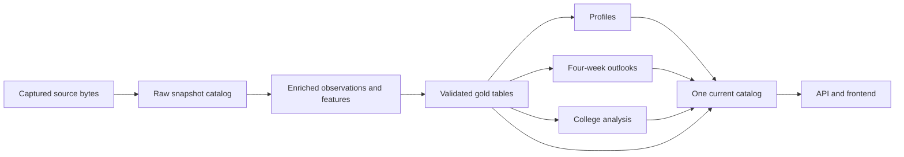

# Canonical data pipeline

The current catalog uses corrected gold `canonical_nextgen_20260923_r1` with
`nextgen_products_20260923_r2_profiles` and `nextgen_system_20260923_r4`.
See [the profile migration](profile_gold_migration_2026-09-23.md) for the published
dependencies, tracking coverage, and forecast serving rules.

## Original r5 migration record

The following documents the initial migration. Its release versions and serving
descriptions are historical; the corrected NextGen catalog supersedes them.

The initial data foundation was `canonical_20260923_r5`. Profiles, four-week NFL
outlooks, and college analysis now build from its gold tables and are selected
together through `data/current.json`. Existing historical model results are
separate, immutable research outputs; they have not been relabeled as new gold
model runs. Production boards and frozen forecasts retain their original versions.



## Layer contracts

| Layer | Location | Responsibility |
|---|---|---|
| Preserved inputs | `data/raw/objects/<prefix>/<sha256>` | Exact copies of captured bytes, deduplicated by content hash. Original captures are never edited or hard-linked to mutable caches. |
| Raw snapshots | `data/raw/snapshots/<version>/manifest.json` | Inventory, origin paths, hashes, source kinds, captured observation cutoffs, configuration, and retained reference provenance. |
| Enriched | `data/enriched/releases/<version>/` | Reproducible parsing, identity resolution, repaired positions, league scoring, event replay, historical feature construction, college normalization, and retained source details. |
| Gold | `data/gold/releases/<version>/` | Named, validated tables with schemas, primary keys, column null counts, roles, quality results, coverage, exclusions, and dependencies. |
| Derived products | `data/research/<product-version>/` | Versioned models, profiles, reports, and validation results, bound to one gold manifest. |
| Current catalog | `data/current.json` | Atomic selection of one gold release and a consistent set of products. Older releases remain reproducible. |

The raw store preserves what we actually have. Existing nflverse and college
captures are provider-cache Parquet snapshots, not reconstructed original HTTP
responses. Some original collection times are unavailable. Existing parsed
transaction exports and league-scored current observations are explicitly tagged
`legacy_enriched_import`; the reviewed absence ledger is `reviewed_annotation`.
Neither is misrepresented as raw provider evidence. Source web captures retain
their original metadata/HTML bytes and the absence ledger retains known dates and
source URLs. Registration time is not publication time.

The first migration uses the accepted historical backfill as a pinned bootstrap
input inventory and replay reference. Enrichment reruns the data transformations
offline from the preserved inputs. It compares all historical input columns except
the legacy ordinal rank against the accepted reconstruction, within 1e-9 numerical
tolerance. Equal-score players can exchange that old ordinal rank because of
aggregation order; the rank is excluded from gold. Audited weekly scoring is also
replayed. Historical model fitting is not required for this pipeline build.

This initial source-registration adapter imports an accepted captured bundle. New
collectors should register additional captured partitions and their availability
metadata at the raw layer, then extend the enriched transformations and gold
contracts. Do not edit gold files directly to backfill a fact. Original publication
vintages cannot be inferred from a successful replay.

## Gold tables and time semantics

The published release contains 25 tables. The primary modeling view is
`preseason_features`: 18,235 rows and 1,091 columns, keyed by
`player_id, forecast_season, forecast_cutoff_date`. Its paired `season_outcomes`
table has the same keys. Outcomes are never included in the feature table.
`source_team` and `prior_season` describe prior observations;
`cutoff_preseason_team` describes the team evidence at the forecast cutoff.

Other tables include:

- `players`: 24,917 NFL identities, without current team/status/position fields
  that could be accidentally reused as historical evidence.
- `nfl_player_weeks`: 423,704 identified observations with league points and
  captured box-score statistics.
- `nfl_player_seasons`, `nfl_team_seasons`, `nfl_weekly_usage`, and `nfl_schedule`.
- `nfl_transactions`: 95,630 source transaction records, retaining source evidence.
- `absence_events`: 97 reviewed, dated announcements and revisions.
- Full `nfl_injuries` and `nfl_snap_counts` observations.
- `college_seasons`: 374,224 school-stint seasons, plus annual, game, identity-link,
  identity-registry, and NFL crosswalk tables.
- `current_weeks`, `current_snaps`, `current_players`, and `current_schedule`,
  explicitly bound to the captured 2026 Week 2 observation cutoff.
- Three quarantine tables, retaining excluded forecasts and unidentified weekly
  observations for investigation.

Only `preseason_features` is a forecast-cutoff view. Observation tables can contain
later events and outcomes: filter by event date/known date before joining them to
historical forecasts. Identity and retrospective descriptive tables are not
historically published snapshots. Provider publication vintages remain incomplete.

Model outputs, Week 1 roster proxies, undated contract proxies, and modeled xFP
are excluded from gold features. Rich historical descriptors use an explicit
feature contract. Unknown new fields remain in enriched data until reviewed.
Undefined numeric ratios (NaN/infinity) become null in gold; zero remains zero.
The per-table manifest records the number of normalized values by column.

## Additional issues caught during this migration

- **981 positional-market rows were published after their forecast cutoff.** Their
  positional ranks and snapshot-dependent metadata are withheld from features.
  The separate dated overall rankings remain available when valid.
- **54 market-only candidate folds depended solely on a later market snapshot.**
  They are quarantined from both feature and label tables; removing their ranks
  alone would not remove the future-informed candidate-selection rule.
- **839 pending 2026 forecast outcomes used zero/false placeholders.** Their gold
  outcome values are null, with `outcome_complete = false` retained.
- **430 historical and 2 current weekly records have no player ID.** They remain
  in quarantine; the pipeline does not invent identifiers or silently discard them.
- Existing undefined target-share and air-yards-share ratios are represented as
  unknown, rather than NaN/infinity, in the canonical analytical tables.

These corrections belong to the data release. Existing saved historical model
results remain archived with their original inputs, including the now-identified
market timing limitation. They need a new model run before claiming the corrected
gold feature contract. The frontend explicitly distinguishes those saved runs from
the current shared data release.

## Quality and coverage

Promotion checks unique/non-null keys, matching feature/label populations,
temporal evidence boundaries, pending outcomes, known-absence caps, current-week
cutoffs, and the full raw/enriched/gold hash chain. Gold includes schema, null-count,
quality, coverage, and feature-policy artifacts. Missing evidence stays unknown.

For the 18,235 included forecast rows:

| Evidence | Rows |
|---|---:|
| Observed roster state | 7,144 |
| Only inferred prior team | 8,679 |
| Known absence constraint | 91 |
| Missing player name | 0 |
| Timestamped depth rank | 1,161 |
| Verified dated contract money/term | 0 |

Coverage remains incomplete. Integrity acceptance does not establish factual
completeness. No recorded suspension or injury announcement does not prove
availability. The lower observed-state count relative to the accepted historical
rebuild reflects the 54 quarantined candidate folds, not lost source evidence.

## Build and consume

Use a new version for each build. Failed or superseded candidates are retained;
only the current catalog selects what the application serves.

```bash
uv run python research/data_pipeline.py build \
  --version NEW_VERSION \
  --history historical_backfill_20260923_r2 \
  --college-source college_source_20260922_r1 \
  --current-report data/outputs/rookie_watch_2026.json

uv run python research/data_pipeline.py products \
  --version NEW_VERSION --prefix NEW_PRODUCTS

uv run python research/data_pipeline.py publish \
  --version NEW_VERSION --prefix NEW_PRODUCTS

uv run python research/data_pipeline.py verify --version NEW_VERSION
```

`just data-build`, `just data-products`, `just data-publish`, and `just data-verify`
wrap these commands. To revise only the gold contract over an accepted enriched
release, use `gold --version NEW_GOLD --enriched-version EXISTING_ENRICHED`.
The current gold release uses enriched/raw version `canonical_20260923_r4`.

```python
from patron.config.settings import get_settings
from patron.data.releases import load_gold

gold = load_gold(get_settings().data_dir)  # pin the current verified release
features = gold.read("preseason_features")
outcomes = gold.read("season_outcomes")  # join deliberately for training/evaluation
weekly = gold.read("nfl_player_weeks")
print(gold.ref)
```

Builds preserve implementation snapshots, configuration, dependency lockfiles,
and environment versions. Stage manifests identify exact dependencies; readers
verify hashes and never silently substitute a different release. Local write locks
serialize builds/publication. Publication validates all three products before one
atomic pointer replacement. Prior catalog files are preserved for rollback.

The currently published products are
`canonical_products_20260923_r2_{college,outlook,profiles}`. Existing per-product
pointers in `data/outputs/` remain legacy compatibility references; once
`data/current.json` exists, app readers use it and fail closed if its referenced
release is unavailable. A standalone legacy product build cannot override the
canonical catalog.

## Frontend

`GET /api/research/data-catalog` exposes the current release, tables, row counts,
observation cutoff, coverage, and limitations. Intelligence displays a canonical
data panel and calls the historical selector **Saved model run**.

Profile, outlook, and college query keys include the catalog token. Requests send
`X-Data-Catalog`; the API checks it before and after serving the request. If the
catalog changes, the response is rejected with a refresh signal, and the frontend
reloads the catalog instead of caching data under an older release. The catalog
also refreshes every minute and on focus. A broken catalog is displayed as an
error, without falling back to older data.

## Storage choice

This implementation uses Parquet, Polars, content-addressed preserved inputs, and
immutable manifests. It adds no storage service or new package dependency.
Iceberg's snapshot, atomic-commit, and concurrent-writer facilities are useful when
multiple engines write shared tables in distributed storage. For this local,
single-writer workflow, the simpler release catalog is sufficient. The layer and
table contracts can survive a later storage migration.
[Apache Iceberg reliability documentation](https://iceberg.apache.org/docs/1.5.1/reliability/)

## Validation

The first publication passed the offline test suite (583 tests), raw-to-enriched
replay, gold dependency verification, and all downstream product loaders. The 13
protected production/reference artifacts remained unchanged. Browser checks cover
the canonical catalog, matching profile/outlook/college releases, historical model
selection, catalog refresh, stale-token rejection, and mobile layout. See
`web/tests/data_pipeline_smoke.py` and `web/tests/profile_smoke.py`.

## Application serving products

After publishing a data/analysis catalog, run `just data-serving` (or
`.venv/bin/python research/build_read_models.py`) to build disposable, page-ready
JSON responses. This does not refit models or modify gold/research artifacts.
The default build includes the complete profile directory, rankings for both
horizons, measurements for all four periods, latest profiles and career comparisons
for current candidates, and their observed completed-season profiles. Other
players, cutoffs, and research scopes use the same handlers with a bounded lazy
response cache. `--no-history` builds a smaller bundle without historical profiles.

Serving bundles live in `data/serving/releases/<manifest-sha256>/`. An atomic
`data/serving/current.json` pointer pins the bundle. Each response has a content
hash; the generation binds the complete analytical catalog, serving schema, and
Python implementation. Builds verify dependencies before committing and share the
catalog-publication lock. A different catalog or implementation makes an older
bundle ineligible; the API computes against the verified current sources until a
new bundle is built. A matching bundle with corrupted bytes fails closed.
Changing build options creates a separate immutable bundle for the same generation.

The API's successful-verification cache records the complete nested dependency
closure. It checks file device/inode, size, modification/change timestamps, ancestor
identity, symlink targets, and relevant directory listings on reuse. Requests share
a verification scope and recheck dependencies before returning. There is no TTL
that permits a changed artifact to remain valid. Hash memoization still verifies
changed bytes. Failed checks are not cached, and request/publication races return
409. API startup warms the current release's verification state.

Decoded Parquet data is bounded to 128 MiB per process, with optional column and
player projection. Serialized response caching is bounded to 64 MiB per process.
These caches are optimizations, not alternate authorities: source verification and
HTTP analysis/incident/catalog boundaries still apply on cache hits. Responses are
compressed in transit. No database, Redis service, or browser Parquet engine is
required. Run `just data-serving` again after changing backend code or publishing a
new analytical catalog; existing data remains available through verified lazy reads.

Run `pytest tests/test_serving_cache.py tests/test_server_pagination.py` for mutation,
replacement, symlink, publication, cutoff/scope, and pagination safeguards. Frontend
query and browser checks are documented in `web/README.md`.
