# Data pipeline: generation, tables, and GCS

This is the supported workflow for producing and sharing queryable data. New
accepted datasets belong in `src/engine/tables/registry.yaml`; selected application
products have generated recipes in `engine.tables.products`. Use the existing
builders, validation, cache, and transport instead of adding another data loader
or upload path. Research runs remain separate until explicitly promoted.

## Use the data

```sh
uv sync --extra shared-data
just data-fetch                  # selects data/releases/tables/current.json
just tables list
just tables query "SELECT team, season, count(*) AS appearances FROM analytics.team_player_games GROUP BY team, season ORDER BY season DESC, team"
```

The small, shareable `data/releases/tables/current.json` pins the last successfully
published selection. Distribute that file to consumers when releasing new data.
It points at an immutable, generation-pinned GCS release; it is not a remote
“latest” lookup. Consumers stay on their chosen release until they fetch another
reference. Explicit versions work too:

```sh
just tables fetch data/releases/tables/RELEASE.json  # choose a pinned historical release
just tables fetch data/releases/tables/correlation_tables_20261003_r2.json --research  # saved study
just tables fetch data/releases/tables/current.json --offline  # use verified local cache
```

Normal SQL sessions open actual native DuckDB tables, read-only. The first query
builds a local database from the selected Parquet releases. Later queries reuse it;
a new catalog gets a new database, so existing readers stay pinned. `just tables
cache` prewarms it. The native database is disposable and is not uploaded to GCS.
Use `--parquet`, or Python `connect(native=False)`, for direct Parquet queries.
Queries do not contact GCS. Connections use UTC, four query threads and a 1 GB
DuckDB memory limit; ingestion uses one writer thread and checkpoints each table
to accommodate wide feature tables. The engine limit excludes Python allocations.

```python
from engine.tables import connect

with connect() as db:
    games = db.execute(
        "SELECT * FROM analytics.team_player_games WHERE team = ? AND season >= ?",
        ["LA", 2021],
    ).pl()
```

`just tables describe NAME` shows schema, keys, lineage, cutoff, and limitations.
`just tables query @my_query.sql --output data/outputs/result.parquet` exports a
result; CSV is also supported. Existing output paths are protected. SQL is trusted
local analyst code, not an untrusted public SQL endpoint.

## Frontend serving coverage

The frontend calls FastAPI; DuckDB runs in the backend. The frontend's TanStack
Query cache manages HTTP responses and is separate from the DuckDB query engine.
Analysis and league-management requests use the application SQL boundary. Explicit
research scope retains the existing artifact readers and research behavior.

| Page or data | Backend read path |
|---|---|
| Team analysis | DuckDB `analytics.team_player_games`, followed by statistical calculations |
| Rankings, rookies, player stats, forecasts, QB passing | DuckDB `analytics.app_analysis_*` and canonical source tables |
| Player profiles | DuckDB `analytics.app_profiles_*`, college tables and approved forecast tables |
| Published ranking history | DuckDB `analytics.app_history_*`, preserving release/cutoff and eligibility checks |
| League ownership, teams, lineups, transactions, draft and results | Captured ESPN observations → local Parquet catalog → native DuckDB → league calculations |
| League forecasts, accuracy and Team strength | Queried league observations, application forecast tables, queried pregame captures, and Team correlation tables |
| Research, college research and archived boards | Existing research artifact readers; unchanged by this migration |

The boundary is `engine.tables.application.query_scope`, enabled by the API for
analysis/league requests and disabled for explicit research scope. It pins the
published query catalog, rejects stale/missing application tables, and routes
shared source readers through SQL. There is no direct-Parquet fallback inside an
application request. Manifests and policy dependencies are still verified from their
preserved artifacts; computations after selection may use Python/Polars. Bounded
response caches and optional precomputed responses are keyed by this same query
catalog. Successful application responses carry `X-Data-Engine: duckdb`.

`engine.tables.products` derives `app_*` recipes from the selected application and
weekly manifests and the published ranking-history chain. It imports declared
outputs, never arbitrary research directories. Refreshing the default registry also
refreshes these recipes. Parquet columns retain their values with an added
`_record_number` key; JSON records use `_record_number` and lossless `_record_json`.
Query JSON fields with DuckDB's JSON operators:

```sql
SELECT player_id, prediction
FROM analytics.app_analysis_rankings
WHERE position = 'QB' AND horizon = 'rest_of_season';

SELECT _record_json::JSON ->> 'id' AS entry_id
FROM analytics.app_analysis_registry;
```

League captures live under `data/league/<league-id>/<season>/data` and use the same
`tables.build`, verification, and native cache implementation. Typed tables include
`league_players`, `league_teams`, `league_schedule`, `league_lineup_entries`,
`league_transactions`, `league_draft`, `league_week_lineups` and `league_snapshot`.
Nested records are also preserved losslessly. ESPN's existing TTL, refresh lock,
and stale-if-error behavior still apply; capture failure does not silently bypass
DuckDB. Pregame logs and reviewed news use their own capture catalogs. These local
league catalogs are not part of the shared GCS analytics release.

```sh
just tables query --data-dir data/league/LEAGUE_ID/2026/data \
  "SELECT owner_team_id, count(*) FROM analytics.league_players GROUP BY owner_team_id"
```

`just data-fetch` installs the shared query catalog for SQL consumers. Running the
full API also requires its original verification/policy artifacts and local ESPN
observations; a table-only replica is sufficient for direct SQL and Team analysis.

## Generate → build → upload

```mermaid
flowchart LR
    A[Capture sources] --> B[Validate source batch]
    B --> C[Build and validate products]
    C --> D[Select application release]
    D --> E[Build registered tables and dependents]
    E --> F[Atomically select table catalog]
    F --> G[Upload immutable Parquet and manifests]
    G --> H[Publish consumer catalog and handoff reference]
    H --> I[Consumer fetch and DuckDB queries]
```



On the designated publisher with source archives and GCS credentials:

```sh
just data-refresh --upload
# Same command without Just:
uv run --extra shared-data engine data refresh --upload

just data-refresh --status
just data-refresh --version weekly_unique_id --upload  # resume this run after failure
```

This captures the next completed regular-season week, builds a validated source
batch, rebuilds the application products, selects their consistent release, then
builds all refreshable registered tables and uploads the resulting query catalog.
An unchanged week still checks recipes and retries any unfinished upload. Frozen
research imports remain manual. `--force` incorporates reviewed same-week source
corrections. Source acquisition, forecast eligibility and season-end rules are
explained in [refreshing application data](refresh-data.md).

For table development using already captured sources, without source acquisition
or forecast/model rebuilds:

```sh
just tables refresh team_player_games --upload  # dependencies and affected dependents
just tables refresh --due --upload             # due daily/weekly recipes
just tables refresh                            # explicitly check every recipe, including frozen imports
just tables verify
```

Both commands call `engine.tables.workflow.refresh_and_publish`; there is one
implementation of table publication and retry. `--upload` is explicit; omit it
for local development. `--store file:///absolute/path/store` exercises the same
contract offline. GCS defaults to `gs://armchair-labs-data/armchair-labs/tables`.
Use ADC/service identity or an existing gcloud login. Consumers need read access
to the objects and manifests; uploading does not make private data public.

| Stage | Implementation | Result |
|---|---|---|
| Production orchestration | `engine.data.pipeline`, `engine.data.refresh` | Capture, build, select products, refresh/upload tables |
| Source contracts | `engine.tables.contracts` | Keys, cutoff-safe features, labels, quality checks |
| Table recipes | `engine.tables.registry`, `registry.yaml`, `builders.py` | Declared keys, dependencies, cadence, code |
| Application promotion | `engine.tables.products` | Selected product outputs and publication history become `app_*` recipes |
| Application reads | `engine.tables.application` | Request-scoped SQL, source/product agreement, no artifact fallback |
| League captures | `engine.tables.league` | Typed local Parquet catalogs and native DuckDB queries using the same build/cache code |
| Table building | `engine.tables.build` | Versioned Parquet, schema, null counts, code snapshots, lineage |
| Publication/retry | `engine.tables.workflow`, `transport` | Verified objects, completion manifest, consumer catalog, reference |
| Byte transfer | `engine.data.shared`, `shared_gcs` | Content-addressed objects, deduplication, checksums, pinned generations |
| Local query/cache | `engine.tables.query` | Read-only DuckDB snapshot of a selected catalog |

`research/data_pipeline.py` and `research/refresh_nextgen.py` are compatibility
wrappers only. `engine.board.pipeline` supports archived board/metric exports and
source enrichment; it is not an alternative table publishing system. `engine
clear-cache` removes download/derived caches; it does not refresh published data.

### Publication and failure rules

- A table build validates keys, required types, row counts and finite quantities.
  Schema, null counts, exact input versions and observation cutoffs are retained.
- Source tables import as a unit. Changed dependencies rebuild their dependents;
  mixed dependency versions cannot be selected together.
- All builds finish before one atomic table-catalog switch. Failed builds leave
  the previous complete catalog selected. Unchanged fingerprints are a no-op.
- Uploads write immutable content-addressed objects first, then the completion
  manifest, then the consumer catalog. Only after success is the small local
  handoff reference updated. Upload failure retains validated local tables and
  the previous published reference. Rerun the same command to retry.
- Application publication and table publication are separate atomic steps. If
  table building fails after application publication, Team analysis withholds
  mismatched observations until the refresh succeeds. Resume the run or execute
  `just tables refresh team_player_games --upload`.
- `--due` measures elapsed hours since a successful build. Scheduling does not
  create new source observations: the full data refresh captures them first.

`deploy/com.engine.data.plist` is the single production launchd template. Edit its
paths and install it on the publisher if scheduling is wanted. It runs `engine
data refresh --upload`. No scheduler is installed automatically. Equivalent cron:

```cron
15 6 * * * cd /absolute/path/fantasy && /absolute/path/uv run --extra shared-data engine data refresh --upload >> /absolute/path/data-refresh.log 2>&1
```

Advanced bootstrap/staged builds use `engine data build`, `enrich`, `tables`,
`products`, `publish`, and `verify`; inspect each command's `--help`. `build` stages
an immutable source batch; `publish` selects a validated application/product set.
After manual application publication, run the table refresh/upload command above.
The normal `data refresh` command performs these steps in order.

## Add or promote a table

For a refreshable finding, add a SQL file next to the registry and declare a recipe:

```sql
-- src/engine/tables/sql/team_season_points.sql
SELECT team, season, count(DISTINCT game_id) AS games,
       sum(league_points) AS qb_wr_te_points
FROM analytics.team_player_games
GROUP BY team, season
```

```yaml
# Under tables: in src/engine/tables/registry.yaml
team_season_points:
  description: Observed QB/WR/TE points by team and season.
  grain: One team per season.
  primary_key: [team, season]
  kind: sql
  sql_file: sql/team_season_points.sql
  dependencies: [team_player_games]
  refresh_hours: 168
  required_columns: {team: String}
```

Then run `just tables refresh team_season_points --upload`. SQL recipes contain one
SELECT (including WITH), over declared dependencies. Python recipes specify
`builder: package.module:function`, receive `BuildContext`, and return a Polars
DataFrame. Read inputs using `context.read(name)`; declare every dependency and
helper module (`code_modules`) or data file (`inputs`) affecting the output.
`kind: source` imports a named validated source-batch table into the same catalog.
Whole-table replacements are intentional; distributed writers and incremental
partition updates are not implemented.

Keep exploratory work under `data/research/`. To retain an accepted study:

```sh
just tables archive-research data/outputs/my_study my_study_001
```

This retains original files unchanged and converts CSV tables to Parquet. Promote
one output with `kind: parquet`, `source: research/my_study_001/tables/RESULT.parquet`,
explicit keys, cutoff and limitations, and the archive manifest in `inputs`.
Omit `refresh_hours` for a frozen study. Include the archive in a distribution with
`just tables publish UNIQUE_RELEASE --research my_study_001`; query consumers need
only the promoted tables, not the research profile.

## Consume from another system

Each reference includes `consumer_catalog`: its GCS URI, SHA-256, byte size and
object generation. That JSON is the language-neutral integration contract; it
lists every table's description, row count, columns, primary key, cutoff, source
reference and limitations. Each table's `parquet` entry supplies the exact object
URI, size, SHA-256 and generation. Column type strings describe the producer's
schema; Parquet carries its portable physical/logical types.

The current release and exact consumer-catalog URI are in
[`data/releases/tables/current.json`](../../data/releases/tables/current.json).
Always distribute that pinned reference; historical release references remain valid.

Systems using this repository can fetch the reference and use `engine.tables`.
Other systems can use only DuckDB and Google's storage SDK (with ADC configured):

```python
import hashlib
import json
from pathlib import Path
import duckdb
from google.cloud import storage

client = storage.Client()
reference = json.loads(Path("current.json").read_text())  # supplied by publisher

def download(spec):
    bucket, key = spec["uri"].removeprefix("gs://").split("/", 1)
    blob = client.bucket(bucket).blob(key, generation=int(spec["generation"]))
    payload = blob.download_as_bytes()
    if len(payload) != spec["size"] or hashlib.sha256(payload).hexdigest() != spec["sha256"]:
        raise ValueError("Published object failed verification")
    return payload

catalog = json.loads(download(reference["consumer_catalog"]))
table = catalog["tables"]["team_player_games"]
Path("team_player_games.parquet").write_bytes(download(table["parquet"]))
with duckdb.connect() as db:
    db.execute("CREATE TABLE team_player_games AS SELECT * FROM read_parquet('team_player_games.parquet')")
    print(db.sql("SELECT team, count(*) FROM team_player_games GROUP BY team").fetchall())
```

Retain the reference alongside any derived analysis to pin its inputs. GCS objects
are not named by table: resolve them through the catalog rather than listing a
prefix or guessing filenames. DuckDB caches are rebuilt locally, never shared as
writable database files. Research/source archives use the same underlying byte
transport but are an explicit separate profile (`just source-fetch`), not a second
way to select queryable tables. See [shared research inputs](shared-data.md).

## Inventory, storage, and Team analysis

The unified release contains 93 tables: 25 cleaned source tables, two explicit
postgame schedules, four analysis tables, and 62 selected application/product-history
tables. Local league catalogs are separate. Run `just tables list` for the full
schema inventory. Representative sources are `players`, `nfl_player_weeks`,
`current_weeks`, `college_annual`, `preseason_features` and `season_outcomes`.

| Analytical table | Contents |
|---|---|
| `analytics.team_player_games` | 59,400 participation-backed QB/WR/TE player-games, all teams, 2013–2026 Week 3 |
| `analytics.player_pair_correlations` | 64,682 season/pooled pair results; filter scope, sample and basis |
| `analytics.rams_pair_correlations` | 100 frozen Stafford-start study pairs, with permutation/BH diagnostics |
| `analytics.rams_pair_correlations_by_season` | 214 frozen study season/pair rows |

The original study and the all-QB refreshable table use different populations;
results are not interchangeable. `starter` receivers require at least 50% offensive
snaps; `active` uses positive snaps for eligible players. Missing appearances stay
absent; verified positive-snap zero-stat games score zero. Season centering is
within each pair's shared games. Undefined correlations stay null; Fisher intervals
are exploratory and unadjusted. Pairwise covariances from different samples do not
form a coherent lineup covariance matrix. The frozen study's exact methodology
remains in `data/research/rams_correlations_20261003/originals/methodology.json`.

Team analysis queries `team_player_games` with parameterized team/year filters,
then applies its existing QB/participation and complete-case lineup statistics.
Its catalog endpoint and browser cache pin the exact table version. Missing,
corrupt or source-mismatched tables fail closed; superseded table tokens return
409. Query-only replicas need no source archives or application catalog.

`nfl_schedule`/`current_schedule` are forecast-safe schedules; the separate
`*_observed_schedule` tables retain realized QB identities and scores. Keep
`season_outcomes` separate from `preseason_features` when forecasting. A table is
queryable evidence, not automatic approval to use future information as a feature.

```text
data/raw/, data/enriched/             # captured bytes and reproducible build inputs
data/tables/batches/<version>/        # validated source-builder batches and quality reports
data/tables/releases/<name>/<version>/# accepted Parquet + manifest + recipe source
data/tables/catalogs/<hash>.json      # immutable consistent query selection
data/tables/current.json             # atomic local query-catalog pointer
data/cache/tables/*.duckdb            # disposable native query database
data/league/<league-id>/<season>/data/ # separate local league table catalog/cache
data/research/<run>/                 # retained studies; explicit promotion only
data/releases/tables/<release>.json  # immutable distribution reference
data/releases/tables/current.json    # shareable reference to selected published tables
```

`data/current.json` selects application forecasts/products, while the table pointer
selects queryable datasets. Old `data/gold/` artifacts and serialized product keys
remain readable through compatibility adapters; there is no new gold query layer.
Never rewrite immutable historical manifests or move their referenced files.

Validation: `uv run pytest tests/test_application_queries.py tests/test_tables.py tests/test_weekly_refresh.py
 tests/test_data_pipeline.py tests/test_team_correlations.py`. The suite checks
source verification, atomic builds, dependency freshness, upload failure/retry,
consumer inventories, fresh/offline fetch, application SQL/research isolation,
league capture round trips, and Team analysis behavior.
