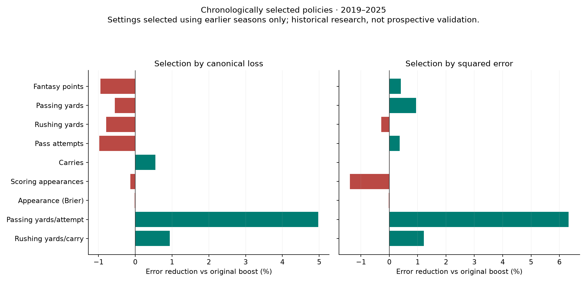
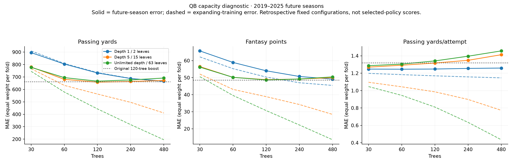

# QB boosted-tree capacity research · September 24, 2026

Completed **195 configurations × nine outcomes × 19 annual folds** (33,345 candidate/fold evaluations). All 513 saved baseline/ridge/boost model-fold outputs reproduced, with maximum prediction difference 0. Canonical error aggregation and row counts also reproduced for every target, model and window.

For modern passing yards, chronological canonical-loss selection has MAE **665.37**, versus **661.70** for the existing booster. Gain: -3.67 yards, 95% paired season-bootstrap interval [-12.88, 7.03]. Across all outcomes and both selection rules, **0/18** modern improvements over the fixed booster survive the predeclared Holm adjustment.

**Disposition: research only.** This study isolates capacity changes on the nine canonical preseason full-season QB outcomes. It does not test weekly forecasts or change production models. All historical years have been reused in prior research; even the recent frozen-settings check is not an independent holdout.

## Interpretation

The tested tuning policies do not establish a broad improvement over the existing booster. Keep the canonical serving policy unchanged. Passing-yard and fantasy-point MAE worsen slightly, with uncertainty spanning improvement and deterioration.

Passing efficiency merits focused prospective comparison: MAE improves 4.97% versus fixed boost, with improvement in 7/7 modern seasons and a similar gain across full history. The most-used selected setup uses just 30 trees and a larger minimum leaf size of 60. Its incremental gain over ridge is only 0.027 yards/attempt (95% descriptive interval [-0.020, 0.074]), so superiority to ridge remains uncertain.

Optimizing squared error produces a small passing-yard tradeoff: RMSE falls from 989.36 to 984.68, while MAE rises from 661.70 to 676.51. The MSE-gain interval includes zero. Greater tree capacity substantially reduces training error, but does not consistently improve future-season error; the stress test below makes that failure visible.

## Matched canonical errors

Every season receives equal weight. Errors below are MAE in the named units, except appearance probability, which uses Brier score. Zero outcomes and backups remain; rate targets use only defined denominators. “Selected” is the full chronological canonical-loss policy, not the best configuration chosen after seeing results.

### 2019–2025

| Outcome | Scored rows | Canonical reference | Ridge | Original boost | Selected |
| --- | ---: | ---: | ---: | ---: | ---: |
| Fantasy points | 794 | 56.95 | 50.42 | 48.50 | 48.95 |
| Passing yards | 794 | 786.39 | 676.40 | 661.70 | 665.37 |
| Rushing yards | 794 | 68.27 | 61.46 | 59.40 | 59.87 |
| Pass attempts | 794 | 111.60 | 95.35 | 92.38 | 93.28 |
| Carries | 794 | 13.73 | 11.91 | 11.95 | 11.89 |
| Scoring appearances | 794 | 3.68 | 3.17 | 3.14 | 3.14 |
| Appearance (Brier) | 794 | 0.2009 | 0.1606 | 0.1564 | 0.1565 |
| Passing yards/attempt | 512 | 1.56 | 1.28 | 1.32 | 1.25 |
| Rushing yards/carry | 518 | 2.13 | 1.83 | 1.79 | 1.77 |

### 2007–2025

| Outcome | Scored rows | Canonical reference | Ridge | Original boost | Selected |
| --- | ---: | ---: | ---: | ---: | ---: |
| Fantasy points | 1,960 | 54.85 | 52.41 | 49.83 | 50.20 |
| Passing yards | 1,960 | 788.58 | 741.19 | 707.59 | 707.58 |
| Rushing yards | 1,960 | 59.71 | 55.58 | 53.14 | 54.02 |
| Pass attempts | 1,960 | 112.60 | 104.26 | 99.45 | 100.02 |
| Carries | 1,960 | 12.39 | 11.15 | 10.93 | 10.91 |
| Scoring appearances | 1,960 | 3.67 | 3.31 | 3.23 | 3.23 |
| Appearance (Brier) | 1,960 | 0.1985 | 0.1614 | 0.1644 | 0.1640 |
| Passing yards/attempt | 1,293 | 1.58 | 1.30 | 1.33 | 1.26 |
| Rushing yards/carry | 1,268 | 2.10 | 1.84 | 1.81 | 1.80 |

## Squared error and uncertainty

Expected-value forecasts also need squared-error evaluation. This independently declared selection policy optimizes earlier MSE with an MAE guardrail. RMSE is the square root of equal-season MSE. Holm values cover all nine outcomes × both policies; unadjusted bootstrap intervals below are descriptive.

**Small-sample limit:** seven modern seasons permit a smallest two-sided exact sign-flip p-value of 2/128 = .015625. The first Holm threshold for 18 tests is .05/18 = .00278. Therefore this conservative modern family cannot establish adjusted significance even if every season improves. Interpret effect sizes, uncertainty and additional future evidence; a failed significance threshold alone cannot establish that tuning has no value.

| Modern outcome | Original RMSE | MSE-policy RMSE | MSE reduction | Holm p |
| --- | ---: | ---: | ---: | ---: |
| Fantasy points | 74.79 | 74.64 | 0.41% | 1.000 |
| Passing yards | 989.36 | 984.68 | 0.95% | 1.000 |
| Rushing yards | 112.06 | 112.22 | -0.28% | 1.000 |
| Pass attempts | 136.04 | 135.79 | 0.36% | 1.000 |
| Carries | 19.95 | 19.95 | -0.01% | 1.000 |
| Scoring appearances | 4.16 | 4.19 | -1.39% | 1.000 |
| Appearance (Brier) | 0.3955 | 0.3955 | -0.02% | 1.000 |
| Passing yards/attempt | 2.55 | 2.47 | 6.33% | 1.000 |
| Rushing yards/carry | 2.48 | 2.46 | 1.22% | 1.000 |



| Canonical-loss policy, modern | Gain vs boost | 95% season interval | 95% two-year-block interval | Winning years | Holm p |
| --- | ---: | --- | --- | ---: | ---: |
| Fantasy points | -0.4573 | [-1.94, 0.8686] | [-1.67, 0.8766] | 2/7 | 1.000 |
| Passing yards | -3.67 | [-12.88, 7.03] | [-10.68, 3.47] | 2/7 | 1.000 |
| Rushing yards | -0.4692 | [-1.67, 0.7801] | [-1.36, 0.3393] | 2/7 | 1.000 |
| Pass attempts | -0.9002 | [-2.96, 1.08] | [-2.98, 0.9430] | 3/7 | 1.000 |
| Carries | 0.0652 | [-0.2801, 0.3667] | [-0.2603, 0.3540] | 4/7 | 1.000 |
| Scoring appearances | -0.0042 | [-0.0526, 0.0394] | [-0.0564, 0.0401] | 4/7 | 1.000 |
| Appearance (Brier) | -0.0000 | [-0.0025, 0.0023] | [-0.0021, 0.0022] | 4/7 | 1.000 |
| Passing yards/attempt | 0.0656 | [0.0350, 0.0960] | [0.0425, 0.0954] | 7/7 | 0.281 |
| Rushing yards/carry | 0.0168 | [-0.0113, 0.0381] | [-0.0091, 0.0380] | 6/7 | 1.000 |

## Capacity, tree count and overfitting

39 paths vary depth (1/2/3/5/unlimited), maximum leaves (2–63), learning rate (.02/.05/.10), minimum leaf samples (5–60), L2 (0/10/100) and feature fraction (.5/.75/1). Each is evaluated at 30/60/120/240/480 trees. The bounded design covers structural interactions and regularization controls, not every Cartesian combination. Maximum leaves is the width/capacity proxy.



Dashed errors use each expanding training set, while solid errors use its next season. The populations and sample sizes differ: the gap is an overfitting diagnostic, not an unbiased estimate of optimism. The plotted fixed-configuration curves inspect reused test years and must not be substituted for policy results.

Unlimited depth, 63 leaves, minimum leaf 5, L2=0, learning rate .10 provides the deliberate stress test below (modern passing yards).

| Trees | Training MAE | Next-season MAE | Next-season RMSE |
| --- | ---: | ---: | ---: |
| 30 | 340.60 | 670.06 | 995.81 |
| 60 | 199.94 | 668.81 | 1008.72 |
| 120 | 107.56 | 676.44 | 1018.74 |
| 240 | 52.23 | 681.06 | 1025.80 |
| 480 | 25.27 | 680.45 | 1030.03 |

## Selection stability and hindsight

Training starts in 2004. Annual tests start in 2007. Until three earlier validation seasons exist, each policy uses the fixed booster. Subsequently the selector uses earlier equal-season losses and a paired one-standard-error preference for simpler models, subject to the declared guardrails. Test-year outcomes are unavailable to the selector; there is no random row split.

| Outcome | Most-used modern configuration | Seasons using it | Distinct modern selections | Hindsight-best modern error* | Actual policy error |
| --- | --- | ---: | ---: | ---: | ---: |
| Fantasy points | `p02_t240` | 6/7 | 2 | 47.88 | 48.95 |
| Passing yards | `p05_t120` | 3/7 | 4 | 653.46 | 665.37 |
| Rushing yards | `p08_t120` | 4/7 | 3 | 58.16 | 59.87 |
| Pass attempts | `p28_t120` | 4/7 | 3 | 90.65 | 93.28 |
| Carries | `p05_t120` | 3/7 | 4 | 11.63 | 11.89 |
| Scoring appearances | `p05_t120` | 7/7 | 1 | 3.09 | 3.14 |
| Appearance (Brier) | `p05_t120` | 6/7 | 2 | 0.1546 | 0.1565 |
| Passing yards/attempt | `p33_t030` | 4/7 | 2 | 1.25 | 1.25 |
| Rushing yards/carry | `p33_t060` | 6/7 | 2 | 1.76 | 1.77 |

*Hindsight error uses the same 2019–2025 labels to choose and score the winner. It is explicitly optimistic search evidence, not achieved forecast performance. A changing chronological policy can occasionally beat every fixed configuration; that does not validate hindsight selection.

Most-used canonical-policy settings:

| Outcome | Depth | Leaves | Trees | Rate | Min leaf | L2 | Feature fraction |
| --- | ---: | ---: | ---: | ---: | ---: | ---: | ---: |
| Fantasy points | 1 | 2 | 240 | 0.1 | 30 | 10 | 1.0 |
| Passing yards | 2 | 4 | 120 | 0.1 | 30 | 10 | 1.0 |
| Rushing yards | 3 | 4 | 120 | 0.1 | 30 | 10 | 1.0 |
| Pass attempts | unlimited | 15 | 120 | 0.05 | 10 | 10 | 1.0 |
| Carries | 2 | 4 | 120 | 0.1 | 30 | 10 | 1.0 |
| Scoring appearances | 2 | 4 | 120 | 0.1 | 30 | 10 | 1.0 |
| Appearance (Brier) | 2 | 4 | 120 | 0.1 | 30 | 10 | 1.0 |
| Passing yards/attempt | unlimited | 15 | 30 | 0.05 | 60 | 10 | 1.0 |
| Rushing yards/carry | unlimited | 15 | 60 | 0.05 | 60 | 10 | 1.0 |

## Recent frozen-settings check

Select settings using only 2007–2022, then keep them fixed for 2023–2025. Training expands annually, so completed 2023 labels can train the 2024 model but cannot change the chosen configuration. Three seasons provide limited evidence.

| 2023–2025 outcome | Original boost | Annually selected | Settings frozen before 2023 |
| --- | ---: | ---: | ---: |
| Fantasy points | 48.66 | 49.80 | 50.28 |
| Passing yards | 662.63 | 672.89 | 670.96 |
| Rushing yards | 59.74 | 60.19 | 60.19 |
| Pass attempts | 94.43 | 93.78 | 93.78 |
| Carries | 11.99 | 12.17 | 12.22 |
| Scoring appearances | 3.22 | 3.19 | 3.19 |
| Appearance (Brier) | 0.1444 | 0.1458 | 0.1449 |
| Passing yards/attempt | 1.39 | 1.31 | 1.31 |
| Rushing yards/carry | 1.63 | 1.63 | 1.63 |

## Cutoff-defined subgroups

Modern passing-yard canonical-policy MAE, using prior passing workload. These groups do not establish starting status, health, or the cause of an error.

| Prior attempts | Rows | Canonical reference | Original boost | Selected |
| --- | ---: | ---: | ---: | ---: |
| 1-299 | 326 | 652.12 | 645.83 | 645.06 |
| 300+ | 204 | 1216.43 | 1051.72 | 1053.01 |
| unknown | 237 | 666.36 | 382.65 | 395.65 |
| zero | 27 | 211.03 | 288.69 | 302.19 |

Across all outcomes, **0 eligible modern subgroup comparisons** (at least 100 rows and three seasons) worsen canonical loss by more than 10% against fixed boost. Overlapping groups are descriptive, not independent tests.

## Limitations and reproducibility

- Preseason full-season study; no weekly-horizon or ranking-promotion claim.
- Repeated historical research; no untouched or prospective holdout.
- Season and two-year blocks do not fully model repeated-player dependence.
- Uses identical reconstructed provider vintages and known canonical source gaps.
- Undefined rate outcomes are excluded only from their rate target.
- Fixed search is bounded and cannot establish a global hyperparameter optimum.
- Squared-error training is evaluated under both canonical and mean-forecast losses.
- Holm adjustment applies to 18 modern selected-policy versus fixed-boost tests only.

Feature sets, missingness, fallback rules, nonnegative clipping and dated availability caps exactly match the canonical source. The existing missing retirement/role-vintage limitations are retained to avoid confounding capacity with input repairs. This study cannot determine injury-caused or role-caused shares of error. Current 2026 outcomes were not used.

Bootstrap intervals resample saved annual errors without refitting or repeating model selection. They omit the uncertainty of a new training/search realization. The paired one-standard-error simplicity rule is a heuristic whose own choice has not been independently validated.

- [Frozen protocol](../data/research/qb_boosting_capacity_20260924_r1/protocol.md)
- [Full results and subgroup errors](../data/research/qb_boosting_capacity_20260924_r1/report.json)
- [All settings and capacity curves](../data/research/qb_boosting_capacity_20260924_r1/capacity_curves.csv)
- [Annual selections](../data/research/qb_boosting_capacity_20260924_r1/selections.json)
- [Policy predictions](../data/research/qb_boosting_capacity_20260924_r1/policy_predictions.parquet)
- [Hashed manifest](../data/research/qb_boosting_capacity_20260924_r1/manifest.json)
- Candidate row predictions and training/test errors are retained in each `folds/TARGET_YEAR.npz` and `.json`; array rows follow `configurations.json`.

```sh
.venv/bin/python research/qb_boosting_sweep.py --version NEW_VERSION --workers 4
uv run --no-sync --with matplotlib python research/report_qb_boosting.py data/research/NEW_VERSION
```

Parameter semantics: [official scikit-learn documentation](https://scikit-learn.org/1.9/modules/generated/sklearn.ensemble.HistGradientBoostingRegressor.html).
